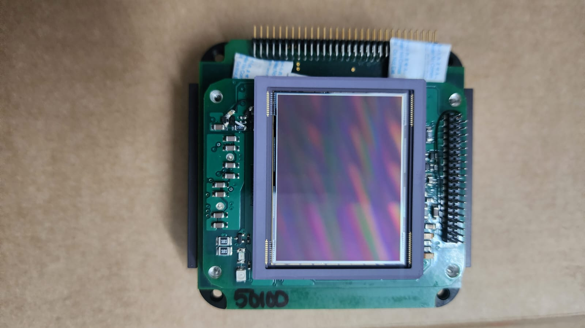
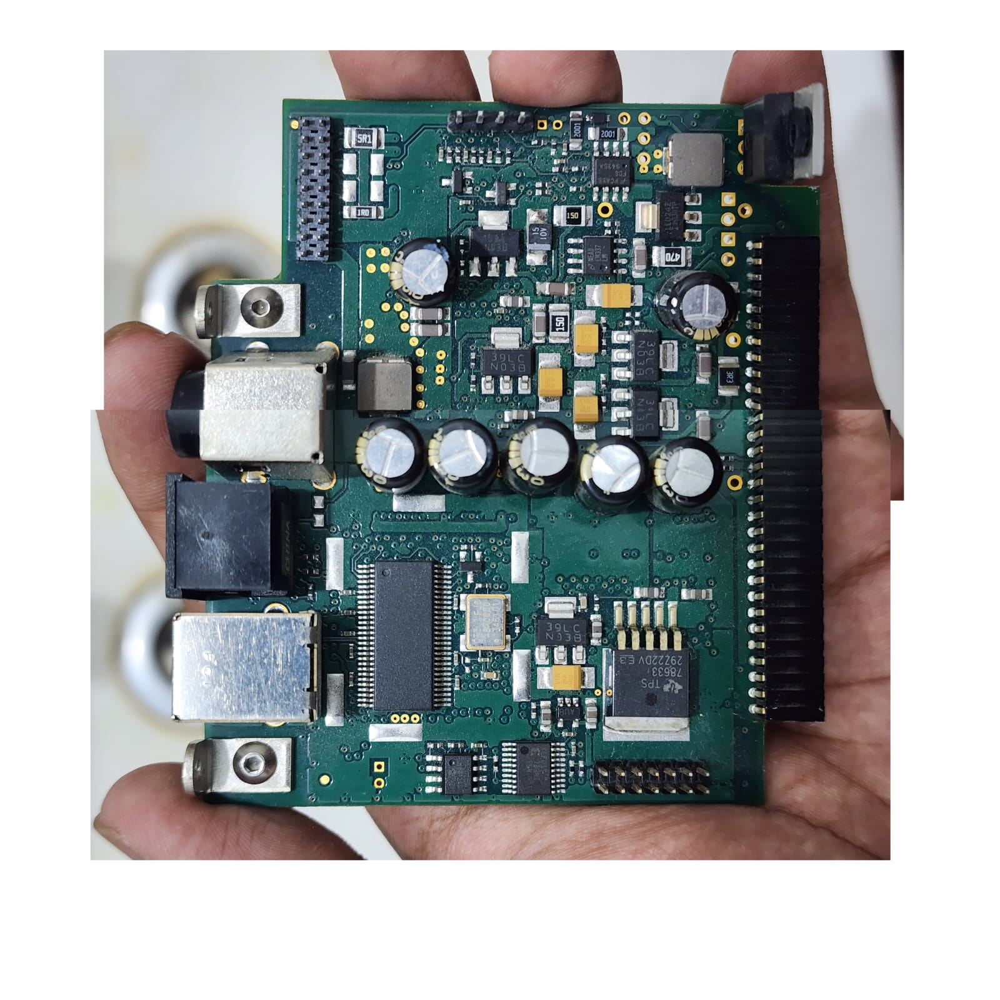
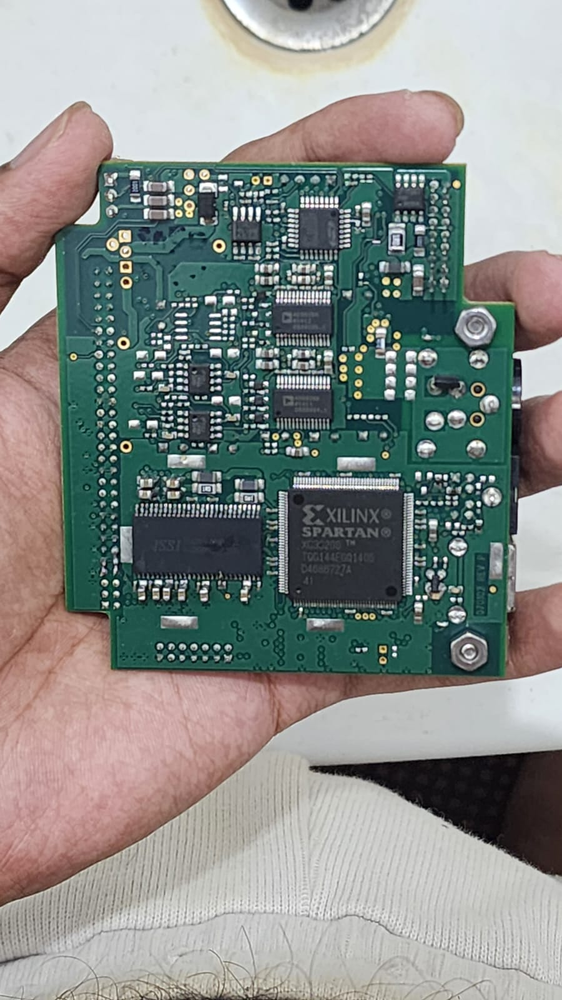

🌌 Cooled Monochrome CCD Astrophotography System
Overview

This project focuses on the design and development of a high-resolution, cooled astrophotography camera centered around the Onsemi KAF-50100 CCD sensor — a 50 MP full-frame device featuring a large imaging area, low read noise, and a dynamic range of approximately 70 dB.

The goal is to create a scientific-grade deep-sky imaging system while maintaining a balance between performance, reliability, and manufacturability. In parallel, a custom tracking mount is being developed to enable long-exposure imaging.

🎯 Objectives
Develop a high-performance cooled CCD imaging system
Achieve low-noise, high dynamic range image acquisition
Design a cost-effective alternative to commercial astrophotography systems
Explore precision instrumentation across electronics, mechanics, and thermal domains
🧠 System Architecture
FPGA Control System

The camera is built around a Xilinx Spartan-3 FPGA, which acts as the central control and timing engine.

Key responsibilities:

Generation of precise multi-phase CCD clock signals
Charge transfer sequencing
Readout synchronization and control

Full-frame CCDs demand strict timing accuracy, making FPGA-based control essential for reliable operation.

📡 Analog Front-End

The signal chain uses the AD9826 CCD signal processor, which integrates:

Correlated Double Sampling (CDS)
Programmable Gain Amplifier (PGA)
High-speed ADC

This ensures:

Low read noise
High signal fidelity
Preservation of sensor dynamic range
Minimal readout artifacts
❄️ Thermal Management

The CCD is mounted on a thermoelectric cooling (TEC) system.

Design considerations include:

Efficient heat extraction
Stable mechanical mounting
Hermetically controlled environment to prevent condensation

Iterative design improvements were driven by:

Alignment stability issues
Thermal interface consistency
Structural rigidity
🔌 Data Interface

The system communicates with a host computer via a Cypress CX7 USB interface, enabling:

High-speed data transfer
Real-time image acquisition
External control and monitoring

The design supports:

Long exposure imaging
Low-noise power delivery
Environmental isolation
🔭 Tracking Mount Development
Iteration 1: Worm Gear Drive
Industry-standard approach
Issues: backlash, periodic error, machining precision limits
Iteration 2: High-Ratio Stepper Drive
Improved resolution via gear reduction
Still susceptible to mechanical errors
Iteration 3: Harmonic Drive (Evaluated)
Near-zero backlash
Rejected due to:
High cost
Fabrication complexity
Integration challenges
Final Design: Friction Drive System

The final architecture uses a high-preload friction drive for the right ascension axis.

Advantages:

Zero backlash
Smooth motion
Reduced periodic error

Key features:

High preload to prevent slip
Precision contact interface
Stepper-driven with optimized reduction ratios

The system prioritizes right ascension precision, with declination treated as a secondary alignment axis.

⚙️ Key Challenges
CCD clocking precision and synchronization
Noise reduction in analog signal chain
Thermal stability and condensation control
Mechanical alignment under thermal stress
Reliable high-speed data transfer
Balancing performance with cost constraints
🚀 Project Vision

This project aims to develop a cost-effective deep-sky observatory system, bridging the gap between expensive commercial solutions and custom-built instrumentation.

It serves as an exploration of:

Precision electronics design
Analog + digital signal integration
Thermal and mechanical engineering
Practical system-level trade-offs
📌 Status

🛠️ In active development — iterative refinement across hardware, firmware, and mechanical subsystems.

